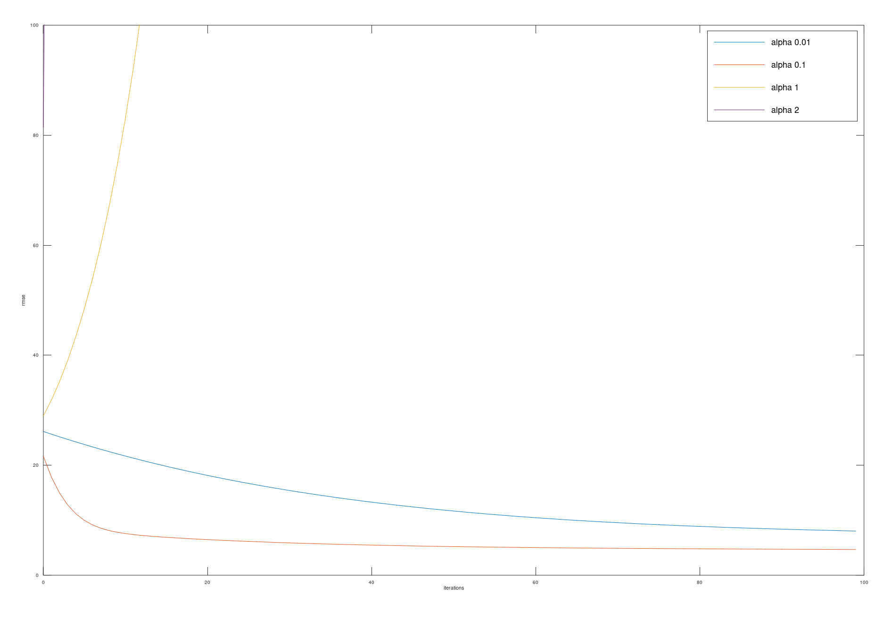

# Machine-Learning-Gradient-Descent
This one is based on the ES-project but this time I use gradient descent instead of evolution strategy.<br>
Evolution strategy randomly modifies the coefficients. That is why it can take a long time until a local optimization is found.<br>
It's possible that gradient descent gets stuck in a local minimum. You can identify this by the fact that the sum of the changes of the theta values is quite small.<br>

Install Octave on a Mac with <b>Homebrew Cask</b>: <br>
```
brew tap octave-app/octave-app
brew cask install octave-app
```

## Preview<br>

